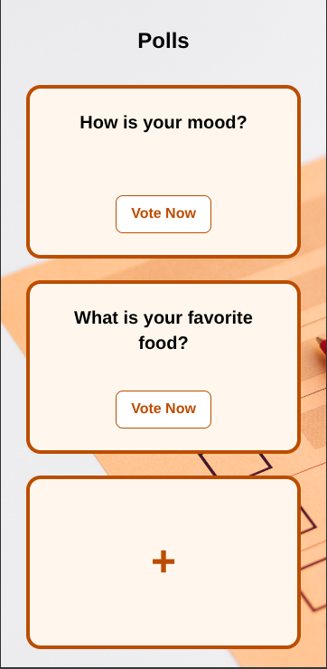
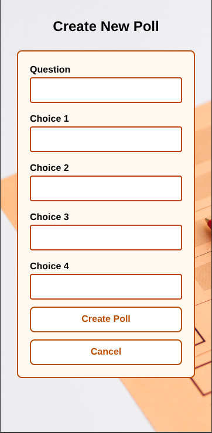
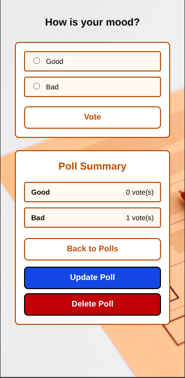
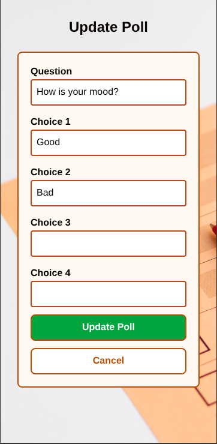
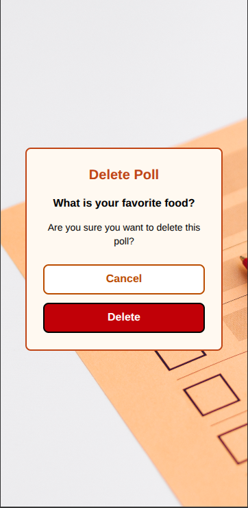

# 🌐 Live Website

🔗 **https://radibdsi.pythonanywhere.com/**  
Access the deployed version of the Django Poll App here.

---

# Django Poll App

A simple polling application built with Django. Users can create or update polls, vote on them, and view results in real-time.

## Tech Stack

- **Backend:** Django (Python)
- **Frontend:** HTML, Tailwind CSS
- **Database:** PostgreSQL

## Features

### Poll Index

View all available polls in a card-based layout. Click "Vote Now" to participate or use the "+" card to create a new poll.


### Create Poll

Create a new poll by entering a question and up to four choices.


### Poll Details and Voting

Vote on a poll and view the poll summary with live vote counts.


### Update Poll

Edit an existing poll's question and choices. After updating the vote count will reset.


### Delete Poll

Remove a poll with a confirmation dialog.


---

## 📱 Mobile Responsive Design

The app is fully responsive and works seamlessly on mobile devices.

<table>
  <tr>
    <td align="center">
      <br>
      <b>Poll Index</b>
    </td>
    <td align="center">
      <br>
      <b>Create Poll</b>
    </td>
    <td align="center">
      <br>
      <b>Poll Details</b>
    </td>
  </tr>
  <tr>
    <td align="center">
      <br>
      <b>Update Poll</b>
    </td>
    <td align="center">
      <br>
      <b>Delete Poll</b>
    </td>
    <td></td>
  </tr>
</table>

---

## Getting Started

1. Clone the repository
2. Navigate to the project directory
3. Install dependencies:
   ```bash
   pip install -r requirements.txt
   ```
4. Navigate to the Django project:
   ```bash
   cd djangotutorial
   ```
5. Run migrations:
   ```bash
   python manage.py migrate
   ```
6. Start the development server:
   ```bash
   python manage.py runserver
   ```
5. Open `http://127.0.0.1:8000/` in your browser
